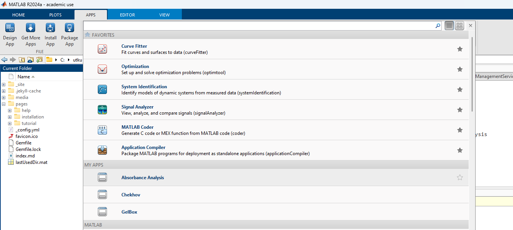

# Installation

## Instructions for MATLAB App Installation

This page instructs you on how to install Absorbance Analysis as a MATLAB App.

+ The MATLAB App installer file can be downloaded from the [GitHub page](https://github.com/Campbell-Muscle-Lab/project_absorbance_analysis/tree/main/app/13Jan26). 13Jan26 installer is the current Absorbance Analysis build. In this case, the installer file is located under your designated Downloads folder.
+ Users can also clone the Absorbance Analysis repository and access the MATLAB App installer file. The installer file is located under `<repo>app\13Jan26`.  The instructions on how to clone a repository can be found [here](../cloning_absorbance_analysis/cloning_absorbance_analysis.html).

Locate `Absorbance Analysis.mlappinstall` file on your computer.

Double-click the `Absorbance Analysis.mlappinstall` and the file will include Absorbance Analysis in your MATLAB Applications. Click Install when the below prompt appears.

After a couple of seconds, go to the Apps tab on the top menu of your MATLAB, shown in red rectangle.

You can find the Absorbance Analysis application under the My Apps section, shown in red rectangle.

Now Absorbance Analysis is ready to be used.
