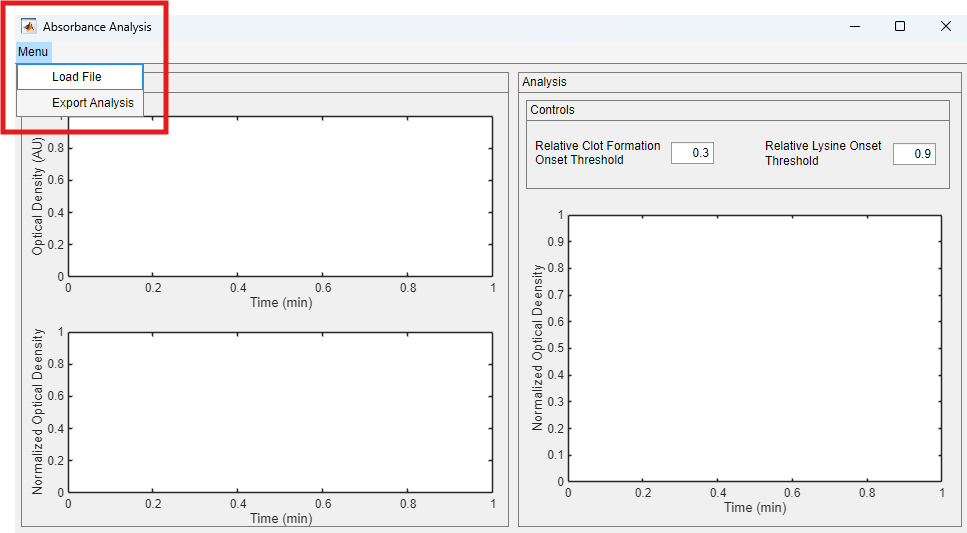
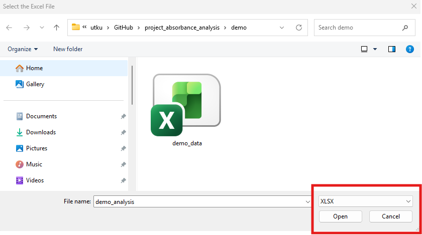
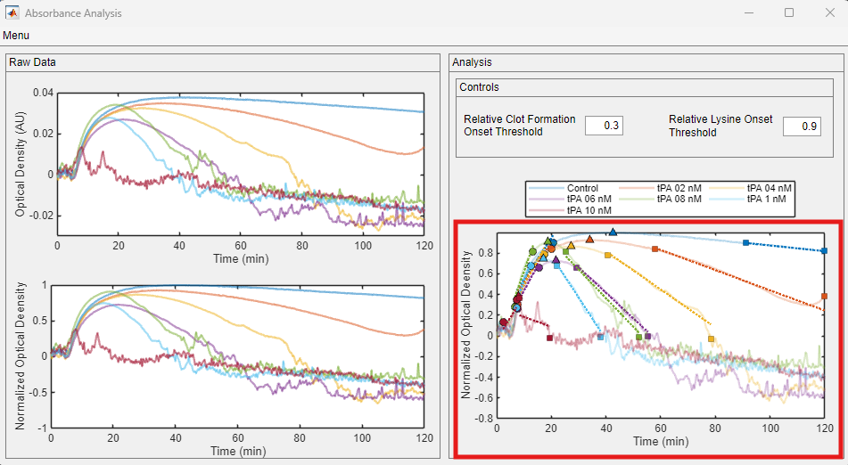
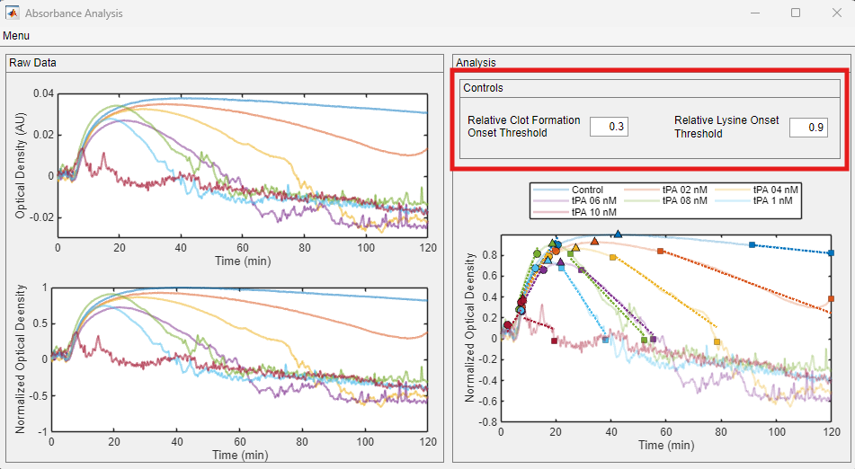
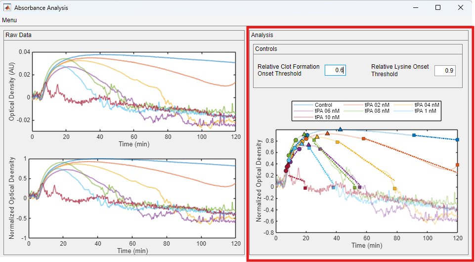
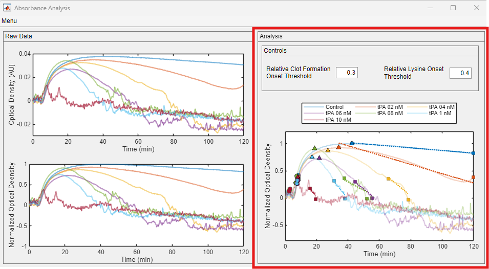
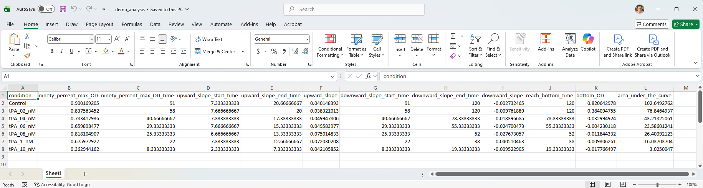

# **Tutorial**

This tutorial provides simple instructions on performing a new analysis. Clicking on any of the images on this page will open a larger version in a new browser window.

## Getting started

+ Using the Absorbance Analysis through MATLAB:
    - Launch MATLAB and navigate to the Apps tab on the top menu. Find the Absorbance Analysis under My Apps and start the application by clicking it. The instructions on how to locate the Apps tab can be found [here](../../installation/installing_matlab_app/installing_matlab_app.html).

+ Using the Absorbance Analysis as a stand-alone application:
    - Locate your `Absorbance Analysis.exe` shortcut and start the application by double-clicking it.

After a few seconds, you should see the program window, given below. 

## User panels

The interface is divided into 2 panels:

- Raw Data: The loaded raw data is shown in this panel. The data normalized with respect to the Control is also displayed.
- Analysis: The locations of interest on the trace are highlighted here.
    + Users can change their thresholds within this panel.

## Loading data

Users start their analysis by loading their data spreadsheets. The interface specifically looking for .XLSX files. Click on the Load File option, shown in red rectangle.

The Load File option opens the below file dialog. The dialog automatically looks for the .XLSX files. Navigate to your folder with the data files and click Open.

## Data visualization

The data file is immediately loaded into the interface and raw traces are displayed. In addition, all the traces are normalized with respect to the experimental Controls following remapping on unit scales.

## Data analysis

The analysis is automated and can be done with minimal input from the user. The analysis display is updated as soon as the data file is loaded, highlighted in red rectangle.

The interface marked multiple points of interests on the normalized traces. The following is listed with respect to their occurrence during the experiment.

- Relative clot formation onset is marked with a circle, the one with the lower relative density. The point at which the density value reached 90% of the maximum density is used to calculate the rate at which clots form. This point is also shown with a circle. The rate is calculated from the fitted line shown in dashed lines.
- Maximum optical density is shown with upward triangle.
- Relative lysine onset is marked with a square at which the density value is 90% of the maximum value. The lysine rate is calculated by fitting a line from the 90% point up to the zero-point. The rate is measured from the fitted line shown in dashed lines.

## Analysis options

Users can change the default threshold values for their analysis using the options shown in the below red rectangle. Please keep in mind that the Relative Lysine Onset Threshold value is shared to calculate the rate of clotting.

### Clot formation onset

Please, note that the onset markers are shifted up.

### Lysine onset

Please, note that the onset markers are shifted down.

## Export analysis

Once users are done with their analysis, they can export the analysis into their host computers. A summary Excel sheet is saved.

Export Analysis option is accessed through the top menu, shown in the red rectangle.

Once it is clicked, it opens a file dialog. Navigate to the folder that you want to use.

The exported Excel file summarizes all the calculated values.

Here are the brief descriptions of each column:

+ ninety_percent_max_OD: 90% of the maximum density value.
+ ninety_percent_max_OD: Time at which the density value reaches the 90% of the maximum.
+ upward_slope_start_time: Clot formation onset.
+ upward_slope_end_time: End point for clot formation rate.
+ upward_slope: Clot formation rate.
+ downward_slope_start_time: Lysine onset.
+ downward_slope_end_time: Lysine trajectory end point.
+ downward_slope: Lysine rate.
+ reach_bottom_time: Elapsed time for trace to pass zero line.
+ bottom_OD: The density value of the point where the trace crossed zero line.
+ area_under_the_curve: Area under the absorbance curve.